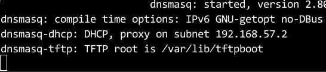
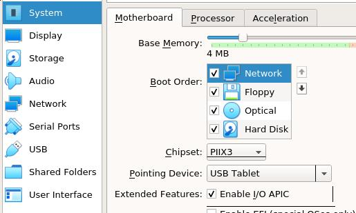
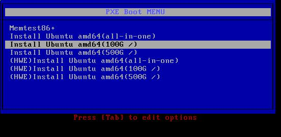
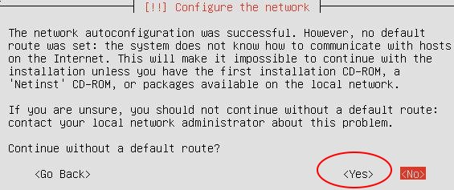
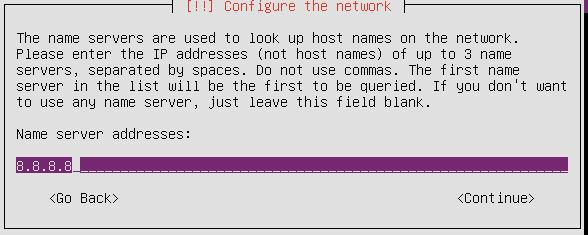
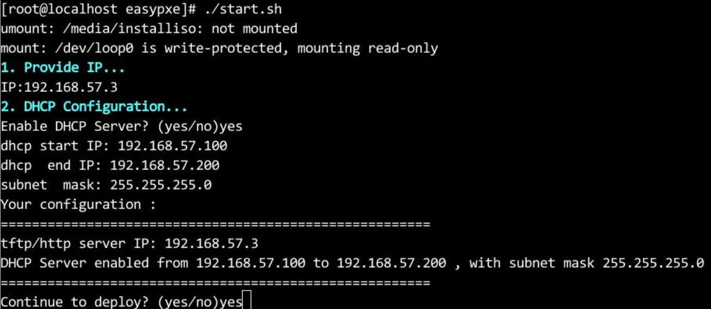
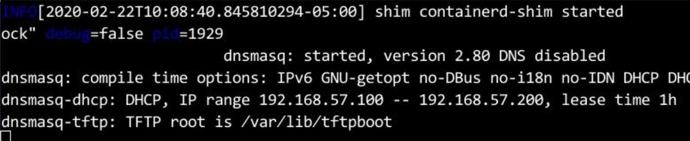

### 1. Introduction
easy-pxe could quickly start pxe server in "air-gapped" environment, which could serve Ubuntu16.04/18.04 OS installation using pxe. 
* 70 MB size.
* Green, needn't install any packages(Dockerd runs in binary mode).
* Fast, tftpd/dns/dhcpd/http server in docker. 
* Runs in most Linux amd64 distributions.
* Currently support Ubuntu 16.04 ~ 16.04.6, Ubuntu 18.04 ~ 18.04.4 pxe deployment. 
* Could be easily customized for adding more Linux distributions.   

### 2. Usage
#### 2.1 Fetch code and make easypxe(Online environment)
Clone the code and run `make_release.sh` for preparing the "air-gapped" deployer.   

```
git clone https://github.com/purplepalmdash/easy-pxe.git
cd easy-pxe
sudo ./make_release.sh
```
`easypxe` folder contains all of the stuffs for starting a "green" pxe server. You also have to put a Ubuntu 16.04/18.04 installation iso into this folder. These stuffs forms the pxe offline deployer.     

An example:    

```
├── clean.sh
├── config
│   ├── config.tar.gz
│   ├── docker-19.03.5.tgz
│   ├── dockerimages.tar.xz
│   ├── preseed
│   │   ├── 16.04
│   │   │   └── preseed.cfg
│   │   └── 18.04
│   │       ├── preseed.cfg
│   │       ├── ubuntu_allinone.cfg
│   │       ├── ubuntu_sep_big.cfg
│   │       └── ubuntu_sep_small.cfg
│   └── pxelinux.cfg
│       └── additional_menu_entries
├── start.sh
└── ubuntu-18.04.2-server-amd64.iso
```
#### 2.2 Quickly start a pxe-server(Air-gapped environment)
Transfer the `easypxe` folder into an Linux amd64 machine(Kernel Version 3.10 or higher), you could choose ubuntu16 or centos/rhel 7 or debian9. Take an centos7 machine for example:    

environment:     

```
ip: 192.168.57.3
gateway: 192.168.57.1
subnet: 255.255.255.0
dhcpd server(external): 192.168.57.2
```

Start pxe server via:     

```
# systemctl stop firewalld
# setenforce 0
# pwd
/root/easypxe
# ls
clean.sh  config  start.sh  ubuntu-18.04.2-server-amd64.iso
# ./start.sh 
umount: /media/installiso: not mounted
mount: /dev/loop0 is write-protected, mounting read-only
1. Provide IP...
IP:192.168.57.3
2. DHCP Configuration...
Enable DHCP Server? (yes/no)no
Provide existing dhcp server IP:192.168.57.2
Your configuration :
=======================================================
tftp/http server IP: 192.168.57.3
Using existing dhcp server:  192.168.57.2
=======================================================
Continue to deploy? (yes/no)yes
```
Seeing this means your tftp server is running:    

```
......
dnsmasq-dhcp: DHCP, proxy on subnet 192.168.57.2
dnsmasq-tftp: TFTP root is /var/lib/tftpboot 
```



#### 2.3 Deploy nodes
Take a vm machine for example, configure `network` to be the first boot option:   



Bootup this vm machine, hit the pxe boot menu:     



Choose one option for deploying. When stucking in following window, select `yes`,then set an random dns server for continue. This is because the default dns server provided via virtualbox didn't supply default gw and dns options. If you use the inner dhcpd, these dialog won't appear.     

Continue without default gw:   



Set dns:    



Wait until installation finishes, using the pre-defined username/password(test/insecure) for login to deployed OS.    

#### 2.4 Deployer with built-in DHCPD Server
When no dhcpd server in your environment, you could use dnsmasq's built-in dhcpd server. Simply specify ip/dhcp start ip/dhcp end ip/netmask after running `start.sh`:    



Running result listed as following:     



Now you could deploy nodes like described in `2.3  Deploy nodes`.    

### 3. Customization
#### 3.1 PXE boot menu Customization
Explanation for PXE boot menu:    

```
all-in-one: all of the disk space for /
100G /: 100 GB for /, the rests for /var
500G /: 500 GB for /, the rests for /var
HWE *: HWE kernel enabled, disk layout explanation the same as above
```

The PXE boot menu is defined in file `src/pxelinux.cfg/additional_menu_entries`

#### 3.2 Installation Customization
You could modify the preseed files under `src/preseed`, add/remove/modify the preseed files for installation customization.     

### 4. Clean
When deployment finished, simply use `./clean.sh` for removing the docker instance and docker images, `clean.sh` won't remove the docker binary files under `/usr/local/bin`. If feel necessary you could manually remove them.    


